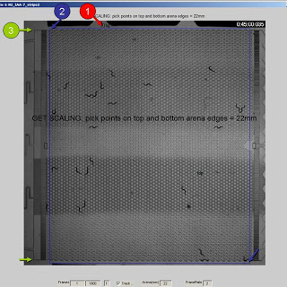

# Getting started with the Arena Worm Tracker
For getting started with the software package, I've added a sample raw video file and the results of tracking on this site.  The video shows wild-type (N2) C. elegans navigating a microfluidic arena and responding to two stripes of isoamyl alcohol over 15 mins.

Get the sample video and analysis in the next section. Warning: it's a big file (>70Mb, .zip).

Once the tracker suite is installed, begin analysis by running TrackerScript.

A frame of the video should appear.  The following user inputs are required, according to the prompts shown in the figure:

* Click a region outside the arena to record background light intensity for each frame.
* Drag a box around the arena to indicate its position.  Choose the left/right edges to exclude at least one whole circular post, to exclude behaviors when the animal touches the upstream/downstream barriers.  Choose upper/lower boundaries just outside of the border.  The selected region turns red.  Click once inside the red box to confirm; otherwise, click outside and drag a new box.
* Get scaling.  The sample video shows a 22 mm vertical device.  Pick two points on the upper and lower boundaries of the arena where they are horizontal (for example, upper-left and lower-left corners).

Analysis should begin and the figure should update every 60 frames, showing the current frame and tracked animals (blue + indicates centroid; red line is prior path).

At the end of analysis, a single multipage PDF should appear in the same folder as the raw video.

Version 1.0 scripts were tested on Win XP and Windows 7 running MATLAB v7.0.1. 
