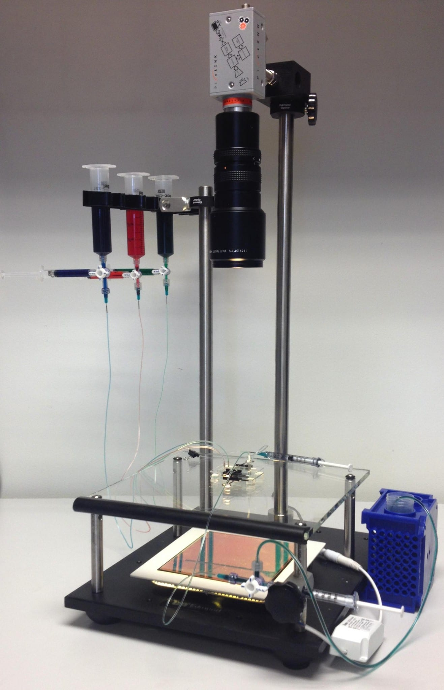

# Hardware Setup

## Building a tracker: our current version 
We recently have built several new video tracking setups for microfluidic behavior experiments. By using inexpensive optics, LED backlighting, and machine vision cameras, we have reduced costs to under $1000 each.  Here we use off-the-shelf support materials, although some custom machining may be required to attach the camera.

Our current setup:

| Vendor | Item Description | Catalog # | Qty | Price Each | Total | Notes |
|-----|-----|-----|-----|-----|-----|-----|
| Edmund Optics | Ring Mount with 0.75" Inner Diameter (ID) | Stock No. #54-264 | 2 | 16.50 | 33.00 |  |
| Edmund Optics | Small Platform Base  | Stock No. #53-009 | 1 |  | 219.00 |  |
| Edmund Optics | 3/4" Dia Stainless Posts, Vertical Post 24"  | Stock No. #52-100 | 1 |  | 60.00 |  |
| Edmund Optics | 3/4" Dia Stainless Posts, Horizontal Arm 18" | Stock No. #39-354 | 1 |  | 55.00 |  |
| Edmund Optics | Steel Post, 4" Length, 1/4-20 Stud | Stock No. #59-000 | 4 | 9.70 | 38.80 |  |
| Edmund Optics | 90 Degree Angle Mount | Stock No. #39-355 | 1 |  | 49.00 |  |
| McMaster Carr | Two Conductor Power Cord NEMA 1-15 Plug, SPT-1-Flat, 18/2 AWG, 6' Length | 7248K21 | 1 |  | 2.29 |  |
| McMaster Carr | Heat-resistant Borosilicate Glass Square, 1/4" Thick, 10" X 10" | 8476K225 | 1 |  | 16.82 |  |
| McMaster Carr | Push-in Flexible Rubber Grommet Ms 35489-91, An 931-c3-5, 3/16" Id, 7/16" Od | 9307K37 | 1 pk |  | 4.84 |  |
| McMaster Carr | 18-8 Ss Button Head Socket Cap Screw 8-32 Thread, 5/8" Length | 92949A196 | 1 pk |  | 5.87 |  |
| McMaster Carr | Standard Rubber Edge Trim 1/4" Opening, 19/32" Inside Depth | 8507K32 | 10 ft |  | 2.49 |  |
| McMaster Carr | Plastic-Head Thumb Screw Black Rosette Head, 1/4"-20 Thread, 5/8" Length, packs of 10 | 91185A805 | 1 pk |  | 11.01 |  |
| Automate Scientific | Syringe Bracket (holds 8x 35ml and 60ml syringes) | sybrk8 | 1 |  | 48.00 |  |
| Ebay | Pixelink PL-A741 (or similar) |  | 1 |  | 150.00 | range 150-300 |
| Ebay | Zoom lens 18-108/2.5 No. 4520988 (or similar) |  | 1 |  | 15.00 | range 15-75 |
| Ebay | 12W Panel SMD LED Ceiling Down Light Bulb Lamp square |  | 1 |  | 22.99 | range 23-28 |
| Amazon | "3M Gold Privacy Filter-3M GPF19.0W Widescreen Monitor Privacy Screen" |  | 1 |  | 74.24 | enough for three |
| Amazon | Dremel 7134 diamond bit, or 3/16" diamond drill bit |  |  | 1 |  | to drill glass |
|  |  |  |  | Total Cost ($) | 808.35 |  |

Building the tracker:

*  Assemble 24" vertical post, 18" post, and four 4" steel posts onto small platform base.
*  Drill four 3/16" holes in the 10x10" glass plate and insert grommets.
*  Attach glass plate to steel posts and add optional rubber edge trim.
*  Solder power cord to LED backlight.  Cut privacy filter to fit backlight, 2 pieces at 90 degrees rotation.
*  Screw syringe bracket to ring mount and add thumb screw.
*  Attach zoom lens to camera and mount to 90 degree angle mount.

